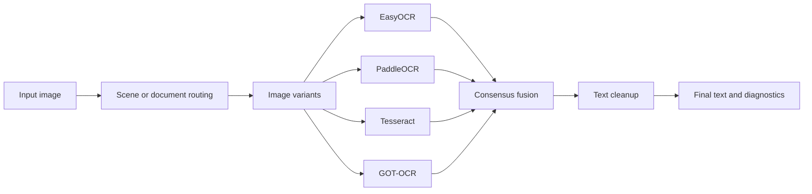
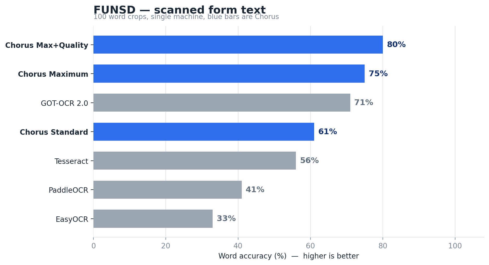
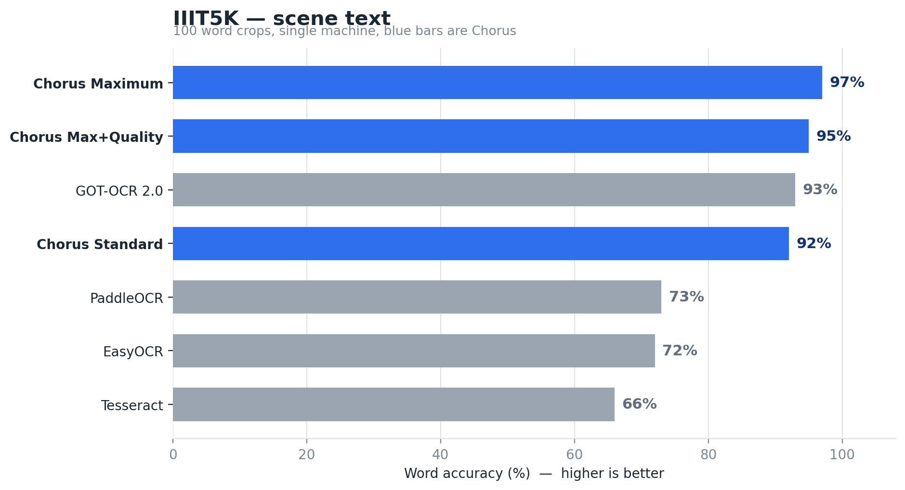
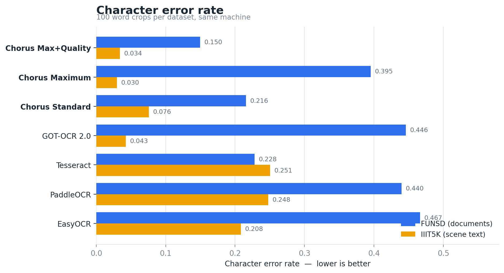
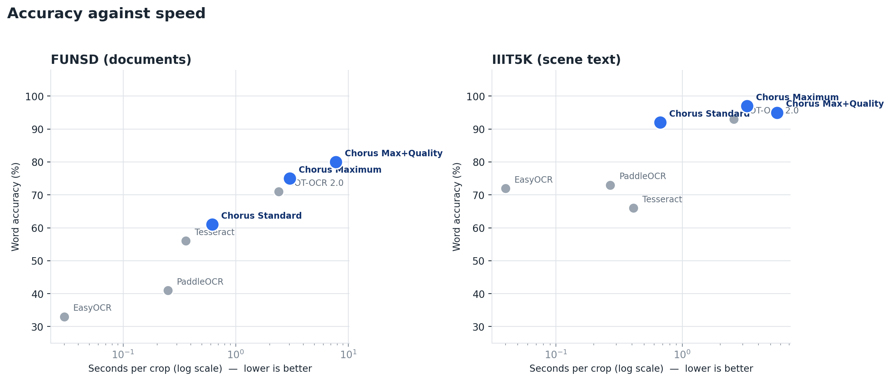

# Chorus OCR

**Upload an image, compare multiple OCR engines, and return one cleaner text result.**

Chorus is an experimental Turkish/English OCR toolkit that combines image preprocessing, test-time augmentation, multiple OCR engines, and consensus-based text fusion. It includes a browser interface for non-technical users, a Python API, and reproducible benchmark tools.

> **Project status:** Public alpha / portfolio project. Suitable for demonstrations and experiments; not yet intended for confidential or production-critical documents.

## Try it without coding

### Windows: double-click launcher

1. Install [Python 3.11 or 3.12](https://www.python.org/downloads/). During installation, select **Add Python to PATH**.
2. Download this repository as a ZIP and extract it.
3. Double-click **`START_CHORUS.bat`**.
4. On the first run, Chorus creates its own environment and installs the demo automatically.
5. Your browser opens. Upload an image and select **Extract text / Metni çıkar**.

The first launch can take several minutes because OCR models are downloaded. Later launches are faster.

### macOS or Linux

```bash
chmod +x start_chorus.sh
./start_chorus.sh
```

## Browser experience

The browser demo is designed for people who do not use the command line:

- Drag-and-drop, clipboard, webcam, or file upload
- Turkish and English labels
- Exactly two clear modes: Standard Fusion and Maximum Performance
- Standard Fusion always uses EasyOCR, PaddleOCR, and Tesseract
- Maximum Performance adds GOT-OCR 2.0
- Copyable OCR output
- Fusion score and detected image type
- Clear privacy warning for public deployments

The repository is also ready to be deployed as a hosted Gradio app. See [`docs/DEPLOYMENT.md`](docs/DEPLOYMENT.md).

## Three operating modes

Chorus does not expose an EasyOCR-only mode. Its core value is multi-engine fusion. The web interface offers three clearly separated speed/quality levels.

| Mode | Engines | Purpose |
| --- | --- | --- |
| **Standard Fusion** | EasyOCR + PaddleOCR + Tesseract | Default multi-engine experience |
| **Maximum Performance** | EasyOCR + PaddleOCR + Tesseract + GOT-OCR 2.0 | GOT-enabled interactive profile |
| **Maximum + Quality** | EasyOCR + PaddleOCR + Tesseract + GOT-OCR 2.0 | Exhaustive TTA quality profile; can take several minutes |

During one-click installation, Chorus asks whether GOT-OCR should be installed and displays this note: **GOT-OCR is required for Maximum Performance mode.**

## How it works



### Main components

| Component | Responsibility |
| --- | --- |
| `chorus/pipeline.py` | Routing, OCR orchestration, and final result |
| `chorus/engines.py` | EasyOCR, PaddleOCR, Tesseract, and GOT adapters |
| `chorus/tta.py` | Upscaling, binarization, CLAHE, denoising, and deskewing |
| `chorus/consensus.py` | Champion selection and ROVER-style voting |
| `chorus/lang.py` | Conservative spacing, punctuation, and numeric cleanup |
| `chorus/web.py` | No-code Gradio browser interface |

## Installation for Python users

Install Chorus Standard Fusion (EasyOCR + PaddleOCR + Tesseract):

```bash
pip install .
```

Install the browser demo:

```bash
pip install ".[demo]"
chorus-demo
```

Add GOT-OCR for Maximum Performance mode:

```bash
pip install ".[got]"
```

Install the browser demo with Maximum Performance support:

```bash
pip install ".[demo,got]"
```

> The project is package-ready but is not yet published on PyPI. After a PyPI release, installation can become `pip install chorus-ocr` from any directory.

## Command line

Standard Fusion:

```bash
chorus testset/en_lowres.png --engines easyocr,paddle,tesseract --json
```

Maximum Performance with GOT-OCR:

```bash
chorus image.png --engines easyocr,paddle,tesseract,got --json
```

The compatibility command still works:

```bash
python pipeline.py image.png --fast --engines easyocr
```

## Python API

```python
from chorus import read

result = read(
    "image.png",
    use=("easyocr", "paddle", "tesseract"),
    fast=True,
)

print(result["text"])
print(result["confidence"])
print(result["route"])
```

`confidence` is a fusion score. It is not a calibrated probability that the text is correct.

## Experimental results

Every engine below was run on the same machine, on the same 100 word crops, with
the scripts in this repository. Blue bars are Chorus.





Fusion beats every engine it is built from. In each mode Chorus scores higher
than any single engine available to that mode.

| Dataset | Best single engine | Chorus Standard | Chorus Maximum | Chorus Max+Quality |
| --- | ---: | ---: | ---: | ---: |
| FUNSD | 0.71 (GOT-OCR) | 0.61 | 0.75 | **0.80** |
| IIIT5K | 0.93 (GOT-OCR) | 0.92 | **0.97** | 0.95 |



Accuracy costs time. Standard Fusion answers in well under a second per crop,
while the GOT-enabled modes trade several seconds for the top scores.



Tuning used a separate split that shares no samples with the numbers above, so
nothing here was optimized against its own benchmark. Full method, per-engine
tables, and the comparison with published cloud and VLM results are in
[`docs/BENCHMARKS.md`](docs/BENCHMARKS.md).

These are experimental observations rather than production guarantees. Hardware,
package versions, model cache, engine selection, sample selection, and routing
changes all affect the figures.

### What this does not claim

Chorus is a fusion layer over existing engines, so it cannot read what all of
its engines miss. Systems such as PaddleOCR-VL report higher scores on
full-page document benchmarks, which measure a different task than the word
crops used here. The defensible claim is that Chorus is more accurate than any
of its own component engines.

Charts are generated from the measured JSON results:

```bash
python scripts/make_charts.py
```

## Running benchmarks

Benchmark datasets are intentionally excluded from GitHub because of repository size and redistribution requirements.

After downloading the datasets from their official sources and placing them under `bench/`:

```bash
python scripts/benchmark_datasets.py funsd --n 100
python scripts/benchmark_datasets.py iiit5k --n 100
```

## Repository size

The public source code, documentation, tests, and small examples are below 1 MB. The following local directories are excluded from Git:

- `bench/` — third-party benchmark datasets
- `tessdata/` — downloadable Tesseract language data
- `archive/` — historical local snapshots
- `out/` — generated benchmark output
- Model caches and virtual environments

## Privacy and responsible use

- The local launcher processes images on the user's own computer.
- Do not upload confidential, identity, medical, financial, or company-internal documents to a public hosted demo.
- OCR output can contain errors and should be reviewed before use.
- Review the licenses and terms of third-party models and datasets separately.

## Tests

Run the fast tests without downloading OCR models:

```bash
python -m unittest discover -s tests -v
```

GitHub Actions runs the same tests and builds the Python package on every push and pull request.

## Known limitations

- Routing thresholds were tuned on FUNSD and IIIT5K samples and may not generalize to every full-page document.
- Multi-engine TTA can be slow on CPU-only systems.
- Confidence values from different OCR engines are not directly comparable.
- GOT-OCR currently uses an adapter-level confidence value.
- Tesseract requires a separate system installation.
- The first run downloads OCR model files.
- Maximum Performance mode requires GOT-OCR and substantially more resources.

## License

Chorus source code is available under the [MIT License](LICENSE). Third-party OCR engines, models, and datasets keep their own licenses and terms.
